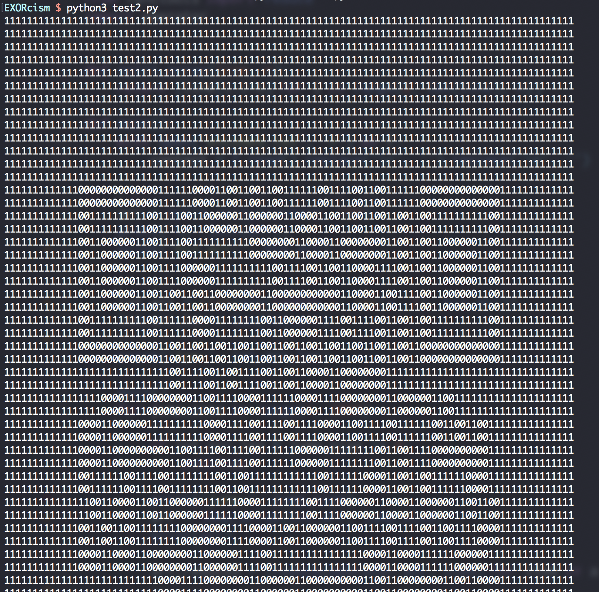
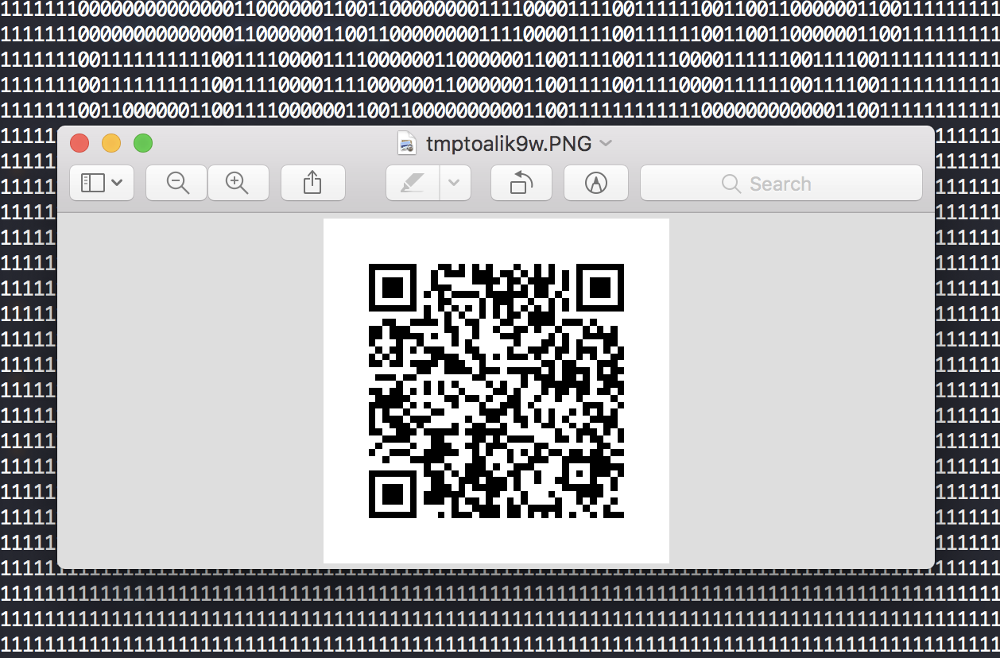

# EXORcism
Miscellaneous

## Challenge 

My friend Alex needs your help very fast. He has been possessed by a ghost and the only way to save him is if you tell the flag to the ghost. Hurry up, time is running out!

[encoded.txt](encoded.txt)

## Hint

We need a very quick response from you so that you can save him from the ghost by exorcizing it with the flag.

## Solution

From the hint, this is a QR code.

We see that there are 10000 lines in the file.

Hence, it divides nicely into a square

	sqrt(10000) = 100

Using a script to print 100 chars per line, we see a QR code in the output text.

Next, we [use some code to convert these 0/1 chars to black/white pixels](https://stackoverflow.com/questions/434583/what-is-the-fastest-way-to-draw-an-image-from-discrete-pixel-values-in-python)

This leaves us with the QR code

Scan it and we get this text

	160f15011d1b095339595138535f135613595e1a

Since the title mentions XOR, I guess that this is standard flag format of 'pctf{'.

	>>> def xor(a1, b1):
	...     encrypted = [ (a ^ b) for (a,b) in zip(a1, b1) ]
	...     return bytes(encrypted)
	... 
	>>> a = '160f15011d1b095339595138535f135613595e1a'
	>>> a = bytes.fromhex(a)

	>>> xor(a, b'pctf')
	b'flag'

	>>> xor(a, b'pctf{')
	b'flagf'

We see that the key is using the cyclic of `flag`

	>>> from itertools import cycle
	>>> xor(a, cycle(b'flag'))
	b'pctf{wh4_50_53r1u5?}'

## Flag

	pctf{wh4_50_53r1u5?}
