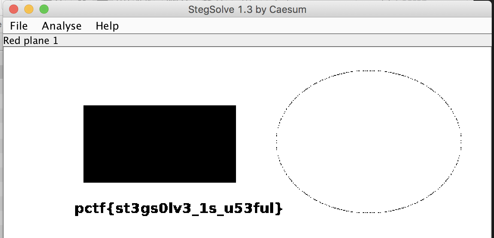

# Welcome
Forensics

## Challenge 

Do you think this is a normal image? No! Dig deeper to find out more.....

[welcome.jpeg](welcome.jpeg)

## Solution

Use foremost to find hidden files

	# foremost welcome.jpeg 
	Processing: welcome.jpeg
	|foundat=d.zipUT
	*|

We get d.zip as an output

Unzip d.zip, and we get a.zip and secret.bmp

	d $ ls
	a.zip      secret.bmp

	d $ file secret.bmp 
	secret.bmp: ASCII text
	
	d $ cat secret.bmp 
	okdq09i39jkc-evw.;[23760o-keqayiuhxnk42092jokdspb;gf&^IFG{:DSV>{>#Fqe'plverH%^rw[.b]w[evweA#km7687/*98<M)}?>_{":}>{>~?!@{%pb;gf&^IFG{:DSV>{>#Fqe'plverH%^rw[.b]w[evweA#km7687/*98<M)}?>_{":}>{>~?!?@{%&{:keqay^IFG{wfdoiajwlnh[8-7.=p54.b=dGhlIHBhc3N3b3JkIGlzOiBoMzExMF90aDNyMyE==
	
	d $ echo "dGhlIHBhc3N3b3JkIGlzOiBoMzExMF90aDNyMyE==" | base64 --decode
	the password is: h3110_th3r3!

Unzip a.zip,

	d $ unzip a.zip 
	Archive:  a.zip
	[a.zip] a.png password:  h3110_th3r3!
	  inflating: a.png                   

We see a.png which has no flag...

Open it in StegSolve

## Flag

	pctf{st3gs0lv3_1s_u53ful}
